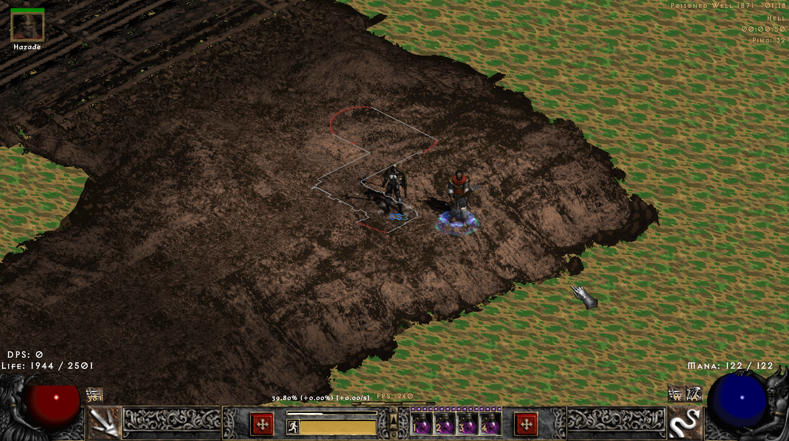
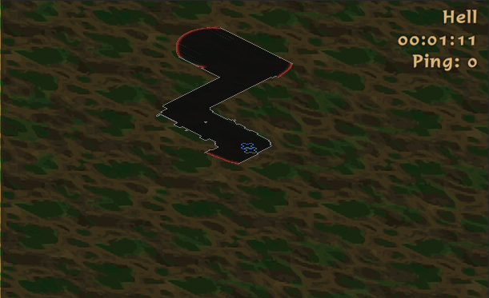

# PD2 Exploration Automap

A community experiment that gives **Project Diablo 2** an expanding exploration map: shaded floors, simple gray wall outlines, a soft reveal edge, and muted red edges that show where there is still room to explore.

Unexplored terrain stays blank. As you move, the map opens around you. Towns use their normal automap without the exploration mask.

This is an **experimental Windows x86 plugin for one tested PD2/D2GL binary set**. It has been tested in a local offline game. It is not an official PD2 feature, a general-purpose loader, or a claim of compatibility with online play or other game versions.

## Repository guide

| File or folder | What's inside |
| --- | --- |
| [docs](docs/) | Design notes, performance results, testing instructions, and gameplay screenshots. |
| [scripts](scripts/) | A read-only checker that compares your game files with the tested build. |
| [src](src/) | The plugin's exploration mask, floor shading, wall outlines, renderer hooks, and background updates. |
| [tests](tests/) | Checks for exploration, clipping, drawing behavior, and incremental map updates. |
| [CMakeLists.txt](CMakeLists.txt) | Build settings for the 32-bit Windows DLL and its three test programs. |
| [compatibility.json](compatibility.json) | Fingerprints of the tested game files and plugin, plus loader and launch settings. |
| [LICENSE](LICENSE) | The MIT license for this project's original source code. |
| [.gitattributes](.gitattributes) | Line-ending rules for source files, documentation, and Windows scripts. |
| [.gitignore](.gitignore) | Files kept out of version control, including local builds, logs, and credentials. |
| [README.md](README.md) | Project overview, screenshots, installation, building, and known limitations. |

## Screenshots

**Overlay view in Poisoned Well.** Gray outlines follow the explored walls; red edges mark unfinished exploration.



**Corner minimap.** The explored area appears in the upper-right map while gameplay stays visible.


**Minimap close-up.** Shaded floors, thin gray outlines, and red edges at unexplored openings.



**Dark Temple overlay.** A larger explored area with connected rooms, gray wall outlines, and red edges marking passages still to explore.


## Features

- Dark gray floor shading and thin gray wall outlines.
- Muted red reveal edges where explored floor continues into unexplored space; edges against known walls remain gray.
- A quarter-subtile exploration grid, fractional draw coordinates, and seven shade bands for a softer reveal edge.
- A 20-subtile reveal radius around the player's movement, retained while visiting other areas in the same tracked session.
- Normal automap behavior in all five towns.
- Incremental geometry caching and a background worker so a growing map does not require a full rebuild with every movement.
- Primitive clipping of normal automap artwork as a fallback when the styled map is unavailable.

The mask is separate from `Wall1`, `Wall2`, `Wall3`, `Wall4`, and other native automap definitions. No artwork or engine DLL is edited on disk. Styled mode draws its floor and outline replacement during the terrain pass; fallback mode clips the existing artwork before it is submitted to the renderer.

## Compatibility

You need your own installed copy of Diablo II / Project Diablo 2 and the matching D2GL renderer. No game binaries, extracted game assets, saves, or third-party renderer binaries are included here.

Check [compatibility.json](compatibility.json) for SHA-256 hashes of the tested `D2Client.dll`, `D2gfx.dll`, `D2Glide.dll`, and `glide3x.dll`. These hashes identify the actual tested files more precisely than a season or launcher label.

From PowerShell in this repository, check an installation without changing it:

```powershell
powershell.exe -NoProfile -ExecutionPolicy Bypass -File .\scripts\Check-Compatibility.ps1 -GamePath "D:\Games\Diablo II\ProjectD2"
```

The runtime also checks hook instructions and renderer entry points. Those checks are limited; they are **not** a complete version or ABI check. Use the listed binary set. An update can disable the plugin or require a source port. See [the hook and architecture notes](docs/architecture.md).

## Install and run

1. Close the game. Keep a copy of your current `d2gl.json` before editing it.
2. Obtain `ExplorationMask.dll` from this repository's release, or [build it below](#build-from-source). Check your engine files against `compatibility.json` first.
3. Copy only `ExplorationMask.dll` into your PD2 game folder, alongside `Game.exe` and `d2gl.json`.
4. In `d2gl.json`, append this entry to the comma-separated string `other.load_dlls_late`, keeping every existing entry:

   ```text
   ExplorationMask.dll:cdecl:InitExplorationMask
   ```

   For example, if the existing value is `SGD2FreeRes.dll`, the resulting section includes:

   ```json
   "other": {
     "load_dlls_late": "SGD2FreeRes.dll,ExplorationMask.dll:cdecl:InitExplorationMask"
   }
   ```

   This is a fragment: preserve the rest of the JSON and its existing settings.

5. Launch `Game.exe` with the game folder as the working directory:

   ```text
   Game.exe -3dfx -direct -exploration-test -log
   ```

   For a Windows shortcut, the **Target** should be `"D:\Games\Diablo II\ProjectD2\Game.exe" -3dfx -direct -exploration-test -log` and **Start in** should be `D:\Games\Diablo II\ProjectD2` (replace that path with yours). Use your normal D2GL HD settings. **Do not add `-w`: the D2GL Glide wrapper rejects it.**

6. Enter an offline game, open the automap, and explore a non-town area. `ExplorationMask.log` in the game folder reports whether initialization and hooks succeeded.

The DLL remains dormant without `-exploration-test`. To remove it completely, close the game, remove only its entry from `other.load_dlls_late`, and delete `ExplorationMask.dll`. Restart the game after any change; live unloading is unsupported.

## Build from source

Requirements: Windows, CMake 3.20 or newer, and Visual Studio 2019 or newer with **Desktop development with C++**, the MSVC x86 toolchain, and a Windows SDK. No game SDK or game assets are required to compile or run the default tests.

For Visual Studio 2022, run these commands from the repository directory:

```powershell
cmake -S . -B build -G "Visual Studio 17 2022" -A Win32
cmake --build build --config Release --parallel
ctest --test-dir build -C Release --output-on-failure
```

For Visual Studio 2019, use `-G "Visual Studio 16 2019"`. CMake must be on your PATH; the Visual Studio CMake component also supplies it. The game requires **32-bit** output even on 64-bit Windows.

The resulting module is `build/Release/ExplorationMask.dll`. CMake uses C++17, the static MSVC runtime, and warnings as errors. A fresh build is not expected to have the same hash as the supplied tested DLL.

The three test executables cover the mask, native primitive clipping, fractional rendering, town bypasses, shading and red-frontier coverage, cached-versus-full geometry equivalence, and worker snapshot handling. They use synthetic data and mocked renderer calls; they do not establish compatibility with a running game. Optional local integration checks are described in [testing.md](docs/testing.md).

## Performance

The current version rebuilds changed regions on a single background worker and draws the latest completed geometry. In one development test with more than 1.4 million explored fine cells, sampled worker builds averaged about **11.4 ms** and automap CPU work averaged about **1.45 ms**, with an observed 240 FPS game display. Earlier full rebuilds in that test had grown to roughly 300 ms.

These are observations from one setup, not a performance guarantee. See [performance.md](docs/performance.md) for the measurement scope and remaining costs.

## Limitations

- Exploration is distance-based, not the game's native revealed state or a line-of-sight simulation. It can reveal through nearby walls.
- Towns bypass this plugin's mask; it does not force the game to load or reveal every town room.
- Exploration is not saved to disk. A player change or a gap of more than two seconds between tracked automap passes can reset the session, including some pauses, map toggles, or minimized windows.
- The soft edge uses discrete shade bands, not a continuous blur. Renderer behavior still affects the final color and smoothness.
- Collision-derived outlines can include small obstacles. Water and other terrain materials do not receive individual styles. Some native cell-based feature artwork is replaced in styled mode; separately drawn plugin markers and text are not all covered by the mask.
- New geometry can briefly lag behind movement. Initial area builds, very large maps, and cache eviction can still cost more time.
- This remains a prototype. Long-session stability is not established. An older test hit a D2Glide texture-cache assertion; its cause was not confirmed, and this release does not claim to resolve that engine failure.

## Contributing

Bug reports, performance measurements, and patches are welcome. Include the four engine hashes, renderer configuration, whether the issue occurs offline, and clear reproduction steps. Review logs before sharing them; do not upload saves, proprietary game files, or personal information.

For a new game build, port and validate the addresses, structures, calling conventions, and render-state assumptions together. Do not simply remove the compatibility guards. The code layout and current interception points are in [architecture.md](docs/architecture.md).

## License and acknowledgments

The original source in this repository is available under the [MIT License](LICENSE). This license does not cover Diablo II, Project Diablo 2, D2GL, BH, or their assets.

Thanks to the [PD2 D2GL](https://github.com/Project-Diablo-2/d2gl), [PD2 BH](https://github.com/Project-Diablo-2/BH), and [D2MOO](https://github.com/ThePhrozenKeep/D2MOO) projects for publicly documented interoperability references. Their code and licenses remain separate; this repository does not vendor their implementations. Diablo II and Project Diablo 2 belong to their respective owners and contributors.
