# Gameplay screenshots

The beta.4 gallery shows the 31-subtile rounded reveal, hybrid map/campaign artwork, fullscreen and corner views, and the five boundary colors. These are original-resolution screenshots supplied from the tested local setup. Visible FPS counters are individual moments, not a sustained performance benchmark.

## Current gameplay and settings

| Screenshot | What it shows |
| --- | --- |
| [Endgame map: rounded reveal](endgame-map-rounded-reveal.png) | A freshly revealed patch around the character shows the 31-subtile circular radius and neon green frontier. Only the explored portion of the automap is visible. |
| [Endgame map: corner minimap](endgame-map-hybrid-corner-minimap.png) | The upper-right minimap keeps gray contours, shaded floors, native water artwork and neon green exploration edges visible while leaving the center clear. |
| [Endgame map: hybrid overlay](endgame-map-hybrid-overlay.png) | Modern gray outlines and soft exploration edges sit alongside native blue water patterns, structures and symbols. The translucent overlay keeps the game world visible underneath. |
| [Act 3 Sewers: corner minimap](act3-sewers-corner-minimap.png) | A compact view of the explored sewer room shows its walls, interior structures and water-channel artwork, with green edges where exploration can continue. |
| [Act 3 Sewers: hybrid overlay](act3-sewers-hybrid-overlay.png) | Straight wall outlines frame the room while the water channel, bridge detail and native symbols remain visible inside the explored boundary. |
| [Automap Options: Boundary Color](automap-options-boundary-color.png) | Boundary Color appears in the existing Automap Options menu. Select the row to cycle through the five saved colors; this screenshot shows Neon Green. |

### Endgame map: rounded reveal

A freshly revealed patch around the character shows the 31-subtile circular radius and neon green frontier. Only the explored portion of the automap is visible.

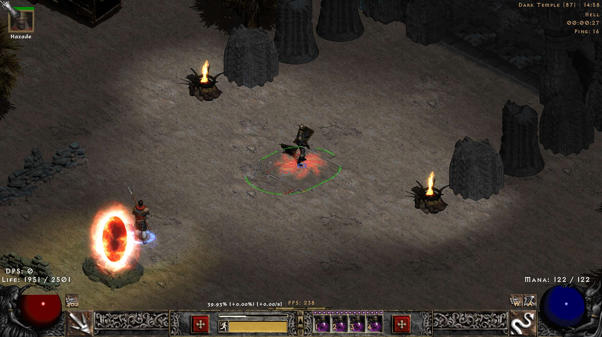

### Endgame map: corner minimap

The upper-right minimap keeps gray contours, shaded floors, native water artwork and neon green exploration edges visible while leaving the center clear.

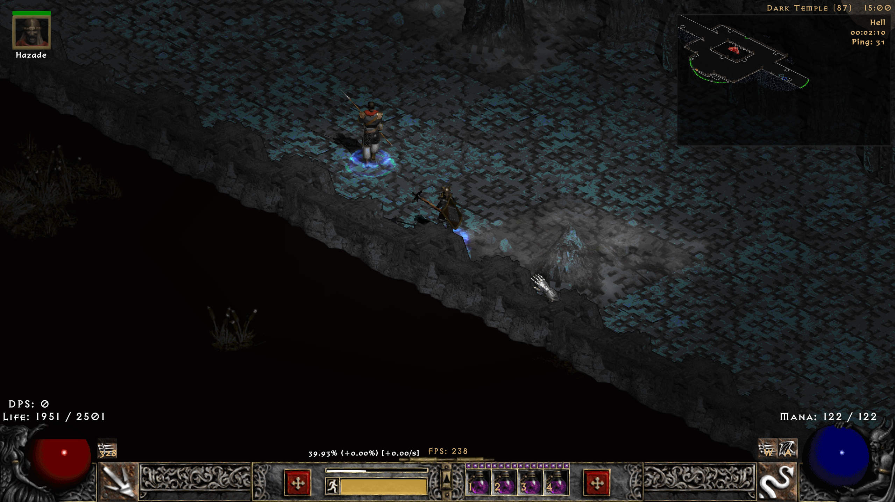

### Endgame map: hybrid overlay

Modern gray outlines and soft exploration edges sit alongside native blue water patterns, structures and symbols. The translucent overlay keeps the game world visible underneath.

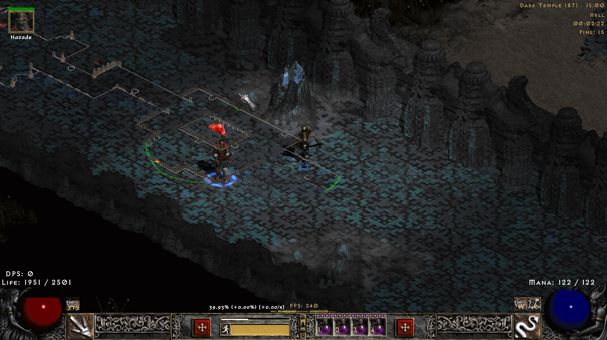

### Act 3 Sewers: corner minimap

A compact view of the explored sewer room shows its walls, interior structures and water-channel artwork, with green edges where exploration can continue.

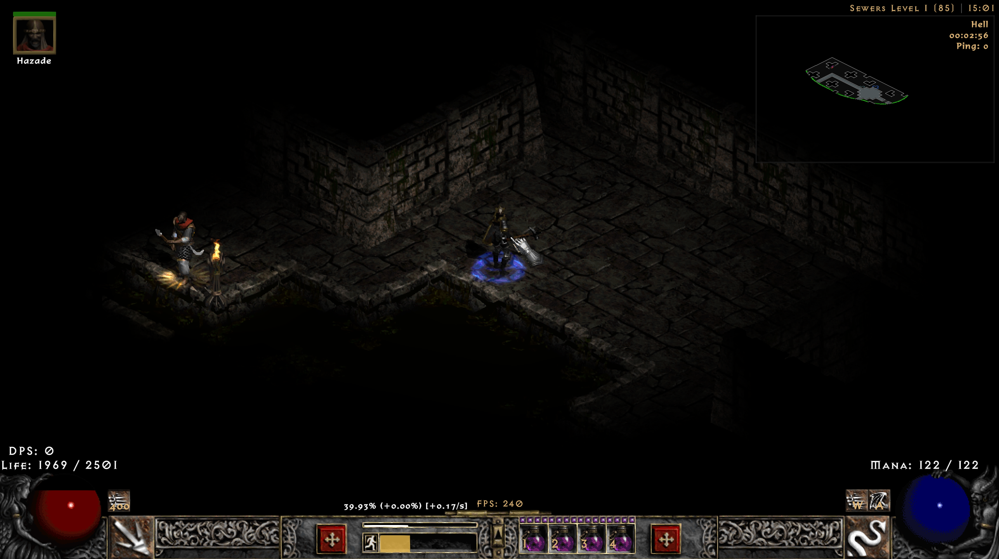

### Act 3 Sewers: hybrid overlay

Straight wall outlines frame the room while the water channel, bridge detail and native symbols remain visible inside the explored boundary.

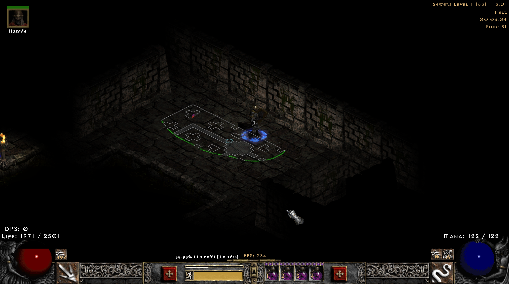

### Automap Options: Boundary Color

Boundary Color appears in the existing Automap Options menu. Select the row to cycle through the five saved colors; this screenshot shows Neon Green.

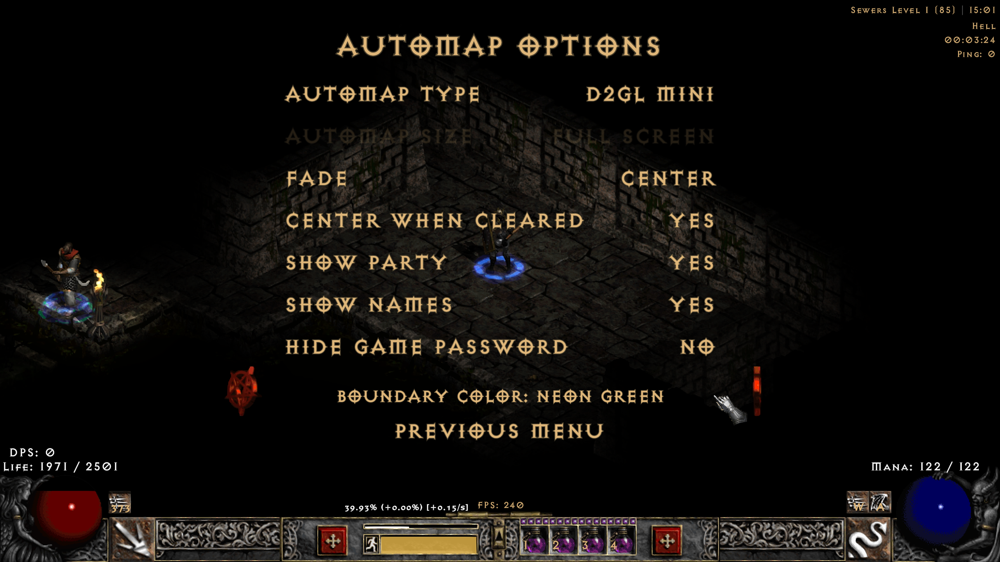

## Boundary color comparison

The character remains in the same sewer location while the frontier color changes. Select a color below to expand its full-size screenshot. Only the exploration frontier uses the selected color; walls, water and native symbols keep their own appearance.

Red

The same sewer frontier in the original muted Red, which remains the default color in the supplied INI.

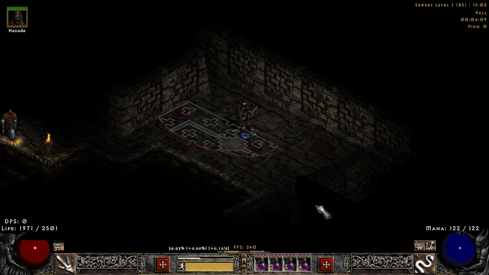

Neon Green

The same sewer frontier in Neon Green, making the unfinished exploration edge easy to distinguish from gray walls.

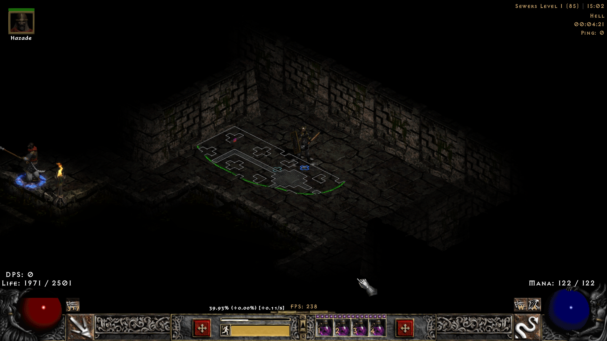

Magenta

The same sewer frontier in Magenta; walls and retained native details keep their own colors.

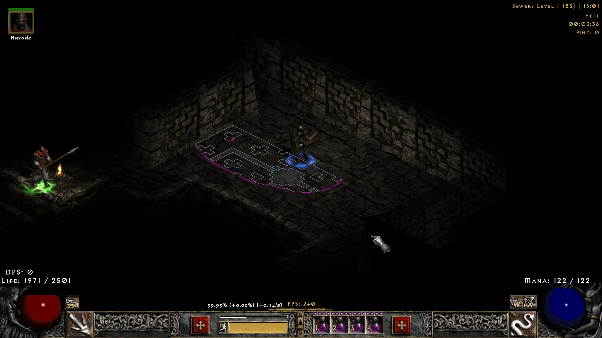

Cyan

The same sewer frontier in Cyan, with the rounded exploration edge following the revealed room.

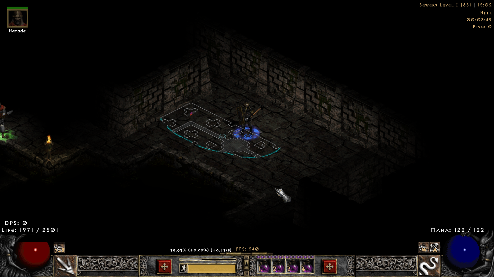

Light Blue

The same sewer frontier in Light Blue, alongside gray wall and water-channel outlines.

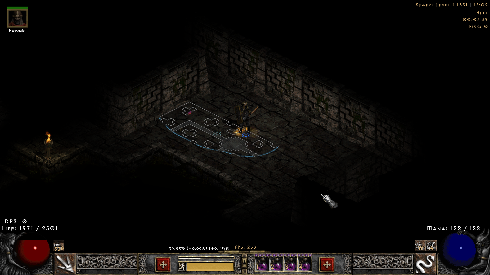

## Earlier screenshots

These retained images document earlier builds and are not beta.4 appearance references.

### Spider Forest: campaign overlay

Gray outlines and red exploration edges sit alongside the familiar blue water patterns, bridges and native symbols. The translucent map leaves the action visible underneath.

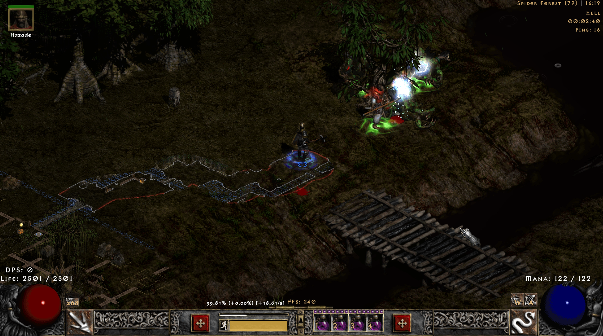

### Spider Forest: corner minimap

The explored route follows the river in the upper-right map, leaving the center of the screen clear.

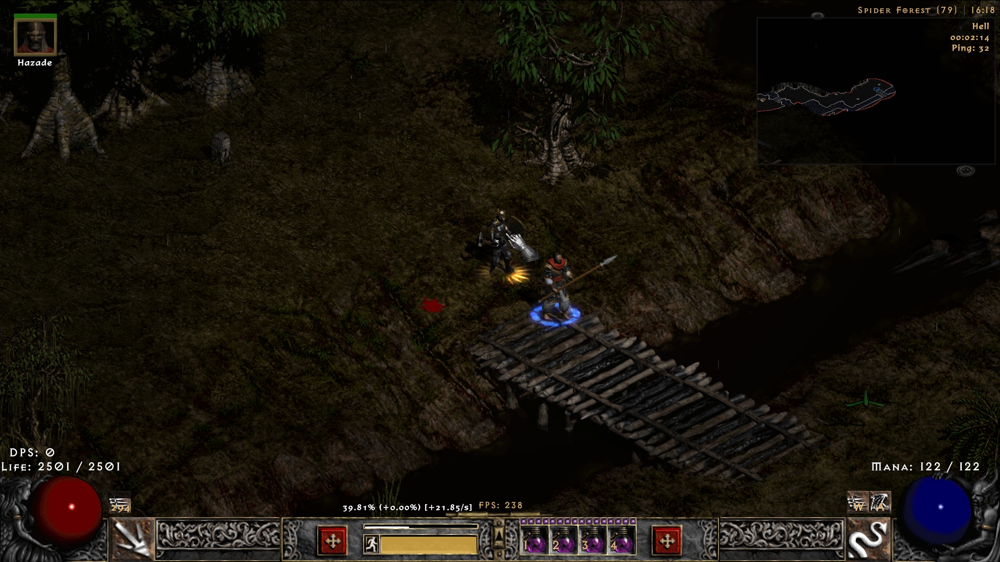

### Poisoned Well: endgame overlay

Thin gray wall outlines and muted red exploration edges trace the revealed passages over the game world.

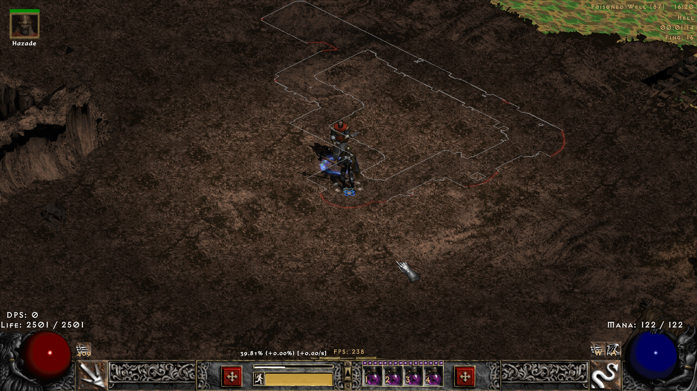

### Poisoned Well: corner minimap

Shaded passages, wall outlines and the exploration boundary stay visible in a compact map.

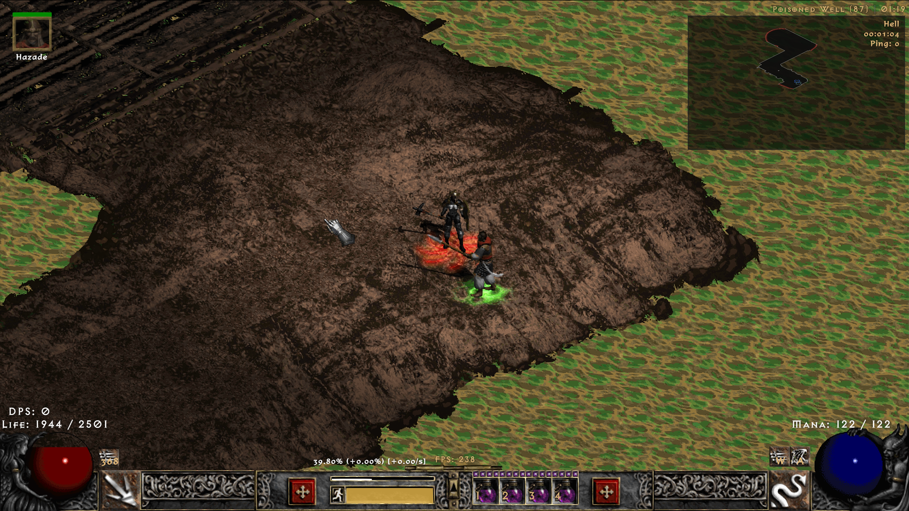

### Earlier example: Endgame map explored rooms

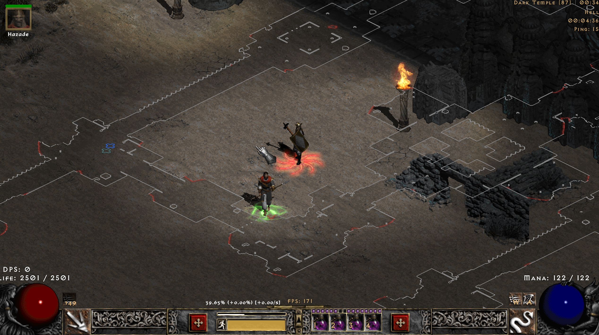

### Earlier example: Poisoned Well reveal-edge close-up

Return to the [documentation index](../README.md) or the [project overview](../../README.md).
